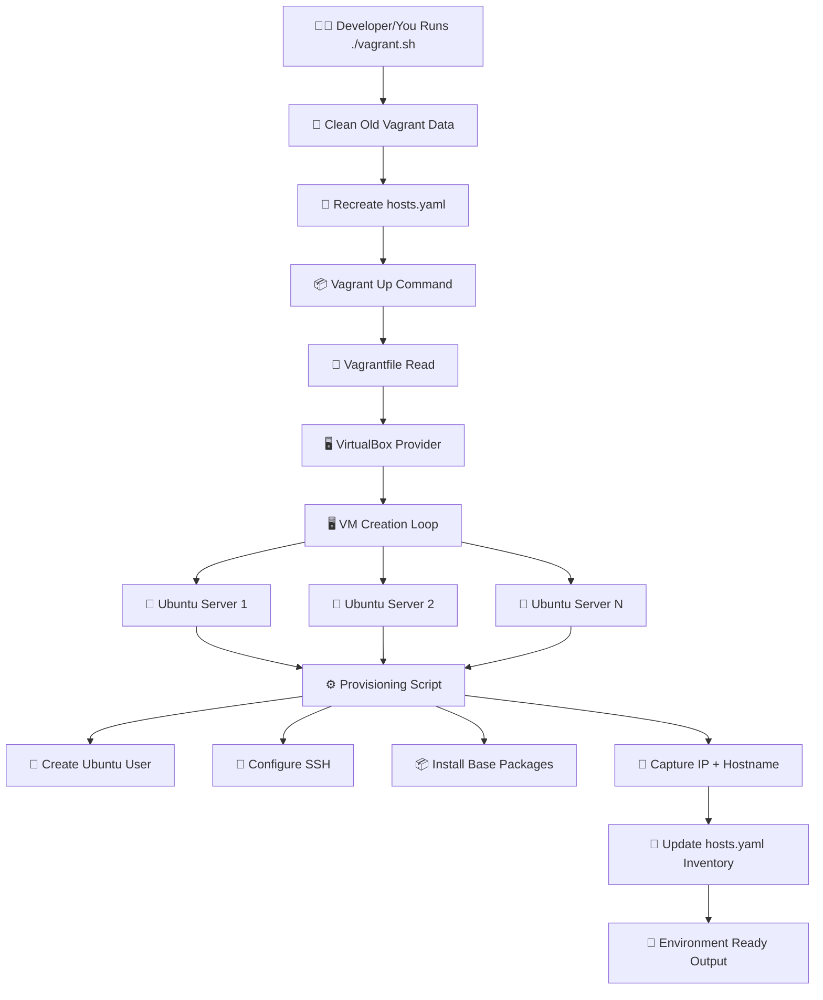

# DevOps Data Center on Your Laptop (Vagrant Lab)

> **Spin up a fully configured multi-server DevOps lab on your laptop with one command.**  
> Practice real-world DevOps workflows without paying for cloud resources.

---

<p align="center">
  
  
  
  
  
</p>

---

> 🆕 **New Feature: VMware Fusion / VMware Desktop provider support added.**  
> Now you can run this DevOps lab on VirtualBox OR VMware environments.

---

## 📌 Table of Contents

* [ Why This Project](#-why-this-project)
* [ Architecture](#-architecture)
* [ Features](#-features)
* [ Supported Providers](#-supported-providers)
* [ Project Structure](#-project-structure)
* [ Prerequisites](#️-prerequisites)
* [ Quick Start](#-quick-start)
* [ Configuration](#-configuration)
* [ Provisioning Details](#-provisioning-details)
* [ Accessing Servers](#-accessing-servers)
* [ Inventory File](#-inventory-file)
* [ Cleanup](#-cleanup)
* [ Troubleshooting](#-troubleshooting)
* [ Contributing](#-contributing)

---

## 🌱 Why This Project

Imagine you’re learning DevOps or Cloud.

You watch tutorials, read blogs, and everyone says:

> “Practice on real servers!”

But... cloud servers cost money 💸  
And setting up multiple Linux machines manually is painful 😓

This project solves that.

✅ Build real Linux servers locally  
✅ Fully automated setup  
✅ Zero cloud cost  
✅ Safe for experimentation  

Think of it as your **mini DevOps Data Center at home**.

---

## 🏗 Architecture


---

## ✨ Features

✔ Create multiple Ubuntu servers automatically  
✔ Configurable CPU, RAM, and disk  
✔ Public network IP assignment  
✔ Password + passwordless SSH  
✔ Dynamic inventory generation (`hosts.yaml`)  
✔ One-command lab deployment  
✔ Reusable and scalable infrastructure  
✔ Supports VirtualBox provider  
✔ Supports VMware Fusion / VMware Desktop provider 🆕

---

## 🖥 Supported Providers

| Provider                | Use Case                                   |
| ----------------------- | -------------------------------------------|
| VirtualBox              | Best for beginners and free setup          |
| VMware Desktop / Fusion | Enterprise-like virtualization experience  |

---

## 📂 Project Structure

```
.
├── Vagrantfile                # Infrastructure definition
├── VMware_Fusion/Vagrantfile  # VMware provider configuration 🆕
├── vagrant.sh                 # One-click automation script
├── hosts.yaml                 # Auto-generated inventory
└── .vagrant/                  # Vagrant internal state
```

---

## ⚙️ Prerequisites

Install:

* Vagrant
* One Hypervisor:  
  * VirtualBox  
        (OR)
  * VMware Workstation / VMware Fusion

Install the required plugins:  

  * Required Plugin (VirtualBox Users)

  ```bash
  vagrant plugin install vagrant-disksize
  ```

  * VMware Plugin (If Using VMware)

  ```bash
  vagrant plugin install vagrant_vmware_desktop
  ```

---

## 🚀 Quick Start

### 1️⃣ Clone Repository

```bash
git clone https://github.com/Syed-Dadapeer226/Vagrant.git
cd Vagrant
```

---

### 2️⃣ Run Automation Script

```bash
chmod +x vagrant.sh
./vagrant.sh
```

---

### 3️⃣ Done 🎉

Your multi-server lab is ready.

---

## 🧩 Configuration

Global variables (Edit once, scale anytime)  

Edit values inside **Vagrantfile**:  

```ruby
VM_COUNT   = 2
VM_MEMORY  = 4096
VM_CPU     = 2
VM_DISK    = 25
VM_NAME    = "server"
```

👉 Change these values → entire lab changes automatically  
👉 Want 5 servers? Just update VM_COUNT

---

## 📦 Provisioning Details

Each server automatically:

### 👤 User Setup

* Creates `ubuntu` user
* Enables SSH login

### 🛠 Tools Installed

* git
* curl
* vim
* net-tools
* and many more...

### 🔐 Security

* Password SSH enabled
* Passwordless SSH configured

### 📡 Automation

* Hostname detected
* IP captured
* Saved to `hosts.yaml`

---

## 🔑 Accessing Servers

### Using Vagrant

```bash
vagrant ssh server-1
```

---

### Direct SSH

```bash
ssh ubuntu@<SERVER_IP>
```

---

## 📄 Inventory File

Example:

```yaml
servers:
  - hostname: server-1
    ip: 192.168.1.10
  - hostname: server-2
    ip: 192.168.1.11
```

---

## 🧹 Cleanup

Destroy lab anytime:

```bash
vagrant destroy -f
```

Your system stays clean.

---

## 🛠 Troubleshooting

### VM Not Starting

```
vagrant status
```

### Network Issues

Restart network adapter or router DHCP.

### Plugin Issues

```
vagrant plugin repair
```

---

## 🤝 Contributing

Contributions are welcome.

Steps:

1. Fork repository
2. Create feature branch
3. Commit changes
4. Open Pull Request

---

📝 Release Updates

✅ feat: add VMware Fusion file for vmware_desktop provider explanation and support  

---

## ⭐ Support

If this project helped you:

* ⭐ Star the repo
* 🍴 Fork it
* 📢 Share with others learning DevOps

---

## 🏁 Final Note

You don’t need expensive cloud infrastructure to master DevOps.

You need:

* Automation
* Practice
* Curiosity

This project gives you all three.

---

**Happy Learning 🚀**
